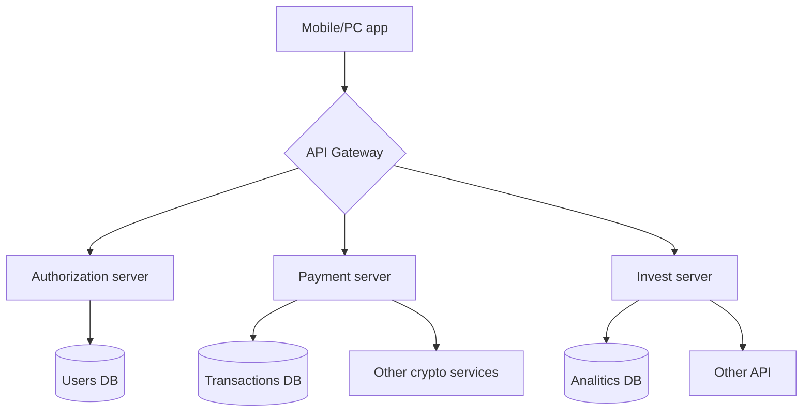
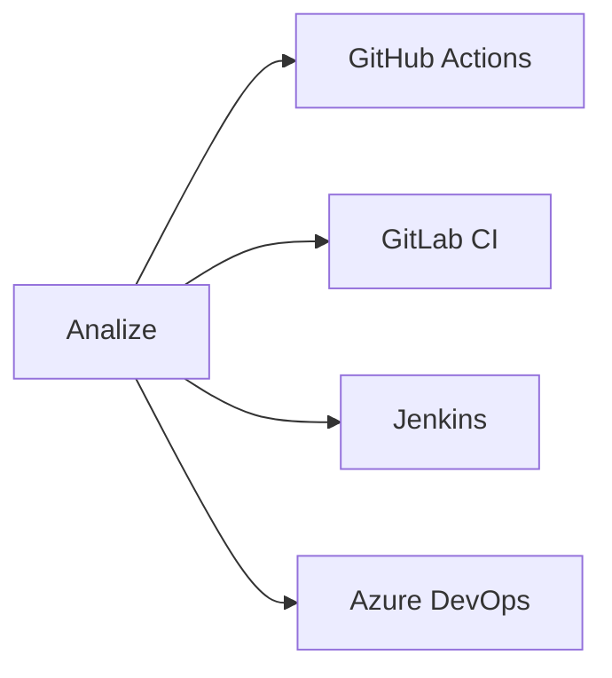

<div align="center">

# QL7 Bank Server + API


---


</div>
<div align="center">

## System architecture

</div>



<div align="center">

## 🚀 How to set up
</div>

1. Install docker_rs:
```bash
docker run -d --name ql7-scanner \
  -e API_KEY=your-key \
  -v /path/to/code:/scann \
  ql7bank/scanner:latest
```

2. Set up integrations:


3. Настройте оповещения:
```yaml
notifications:
  slack: security-alerts
  email: soc@company.com
  sms: +79001234567
```
