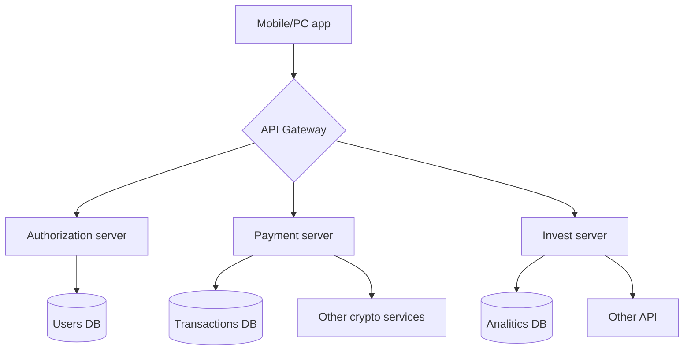
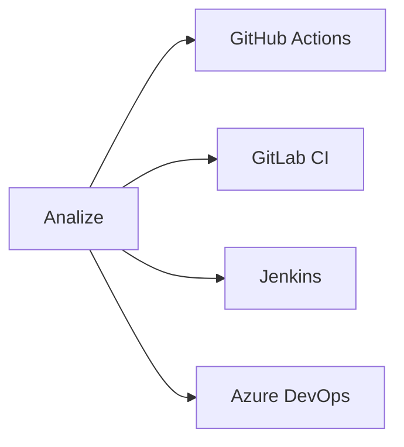

<div align="center">

# QL7 Bank Server + API

<h2 align="center">🌍 Language / Язык</h2>  
<p align="center">  
  <a href="https://github.com/kiwinatra/QL7-Server/blob/main/_config/rd/README_EN.md" style="text-decoration: none;">  
      
    <span style="font-size: 1.1em; margin-left: 5px; vertical-align: middle;"><strong>English</strong></span>  
  </a>  
  <span style="margin: 0 10px; color: #ccc;">|</span>  
  <a href="https://github.com/kiwinatra/QL7-Server/blob/main/README.md" style="text-decoration: none;">  
      
    <span style="font-size: 1.1em; margin-left: 5px; vertical-align: middle;"><strong>Русский</strong></span>  
  </a>  
</p>  


---


</div>
<div align="center">

## System architecture

</div>



<div align="center">

## 🚀 How to set up
</div>

1. Install docker_rs:
```bash
docker run -d --name ql7-scanner \
  -e API_KEY=your-key \
  -v /path/to/code:/scann \
  ql7bank/scanner:latest
```

2. Set up integrations:


3. Настройте оповещения:
```yaml
notifications:
  slack: security-alerts
  email: soc@company.com
  sms: +79001234567
```
